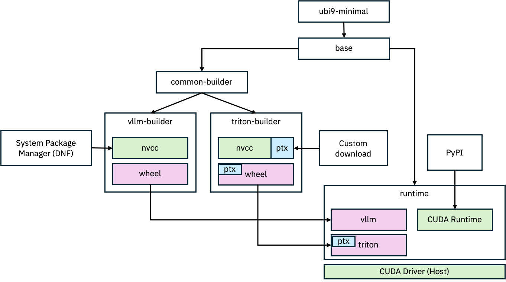

# vllm-triton-backend

This repo contains:

- A Triton-only attention backend for vLLM, implemented as [vLLM platform plugin](https://docs.vllm.ai/en/latest/design/plugin_system.html), see [`ibm-triton-lib/ibm_triton_lib/backend`](./ibm-triton-lib/ibm_triton_lib/backend/). 
- New Triton kernels that implement different attention algorithms, see [`ibm-triton-lib/ibm_triton_lib/kernels`](./ibm-triton-lib/ibm_triton_lib/kernels/).
- Containerized development environment (vLLM + Triton built from source). 
- A microbenchmarking framework for evaluating their performance. 

Triton kernels require autotuning to achieve best possible performance, but naïve autotuning comes with a significant overhead at runtime. Therefore, this repository depends on [triton-dejavu](https://github.com/IBM/triton-dejavu) to reduce the overhead of autotuning to zero while still adapting triton kernels for each platform and request individually. The necessary dejavu data can be found in [`ibm-triton-lib/ibm_triton_lib/kernels/dejavu_data`](./ibm-triton-lib/ibm_triton_lib/kernels/dejavu_data/).

## How to use

This repository can be used as microbenchmark framework and as vLLM plugin. In the following, we explain how to [build our container development environment](#1-build), how to [run microbenchmarks](#2-run-microbenchmarks), and how to [run triton-only attention in vllm](#3-run-vllm-triton-only-backend).

### 1) build

To build the docker image:
```
git clone --recursive https://github.com/foundation-model-stack/vllm-triton-backend.git
cd vllm-triton-backend
make build
```

Please note that this build process installs the pre-build vllm v0.7.2. 

### 2) run microbenchmarks

To run the various benchmark:
```bash
mkdir results
chmod o+w results
docker run --gpus all -it --rm \
    -v $(pwd)/scripts:/scripts \
    -v $(pwd)/ibm-triton-lib/ibm_triton_lib:/opt/runtime/lib64/python3.12/site-packages/ibm_triton_lib \
    -v $(pwd)/results:/results \
    vllm-triton-backend-$(id -un) /scripts/benchmark.py
```
The results of the benchmark are written to the results folder. 
One can edit the benchmark scripts and the kernel code without rebuilding the container.

Since `ibm-triton-lib` is also installed as python package in the vllm-triton-backend image it can be used in python scripts with `import ibm-triton-lib`.
However, if latest version of the `ibm-triton-lib` should be used, without frequently re-building the docker image, it could be mounted in the installed directory, which is currently `/opt/runtime/lib64/python3.12/site-packages/ibm-triton-lib/`, as shown above. Similar applies for the `triton_dejavu` or `vllm` module or the `scripts` folder.

### 3) run vllm triton-only backend

#### Using our container

To run vLLM with triton-only attention backend after [building our container](#1-build):
```bash
docker run -it --rm --gpus all /path/to/models:/models vllm-triton-backend-$(id -un):latest -m vllm.entrypoints.openai.api_server --model /models/granite3.1-8b/base/

```

#### Outside/stand-alone of our environment

The Triton-only attention backend can be used within our [Docker container](#dev-environment) or outside. 
To install this plugin in any other environment:
```
git clone https://github.com/foundation-model-stack/vllm-triton-backend.git
pip install ./vllm-triton-backend
```

If using `ibm-triton-lib` outside from our container, the following needs to be taken into account:

- at least triton 3.2 is required, and therefore pytorch >= 2.6
- our plugin must be installed after vllm (see [documentation](https://docs.vllm.ai/en/latest/design/plugin_system.html))
- the vllm-triton-backend depends on [triton-dejavu](https://github.com/IBM/triton-dejavu)


## Dev Environment

This repo also contains a container aimed at development and using a custom vllm build. 
This development container can be build with:
```
make clean
make dev
```

Please note that this build process is designed to avoid lengthy re-compilation of the CUDA/C++ sources of vllm (which could take up to 30min). Therefore, the current setup triggers a rebuild of vllm **only** if `git add`, `git rm`, or `git commit` affecting files inside the vllm submodule are executed (or the complete submodule is updated, c.f. [`git-updated-index`](https://git-scm.com/docs/git-update-index)). If files in the vllm submodule are "just" changed (and *not* marked for commit or committed), only the copy of the vllm python files into the site-packages happens during build of the image. This minor inconsistency during `make build` is intended, since our focus are triton kernels, not debugging vLLM CUDA.

To ensure a clean build (that reflects all changes to local files), `make clean` can be executed, which forces a re-build of vLLM C sources (if not the exact build is already present in the docker cache).

The development image is also based on `ubi9-minimal` and the vllm and triton builds are isolated, both from each other, and the runtime. 
This allows us to ensure that runtime dependencies are minimal, and allows us to clearly see the different places that CUDA gets pulled in.

During build, vLLM requires a system installation of the CUDA toolkit. We install it from the system package manager.
On the other hand, Triton automatically downloads its own version of CUDA and PTX during build, we do not control this. 
It does not require CUDA to be installed in the system or otherwise.

At runtime, there are three different CUDA-related things that we need to be aware of:
1. The CUDA runtime that gets installed via pip (e.g., due to pytorch dependencies).
2. The PTX version that is bundled inside the Triton wheel.
3. The CUDA driver version that is running on the host machine (e.g., outside of docker container).

All 3 of these versions can potentially be different, but need to be compatible. 

See figure below:




## Improved Proton Viewer

This repo contains a custom version of tritons proton viewer: [`./scripts/roofline/proton_viewer.py`](./scripts/roofline/proton_viewer.py)

The main differences are:
1. It adds a real roofline analysis by introducing the metrics `util_flops` and `util_bytes`.
2. It fixes the confusion of the metrics `flop/s` vs `flops`. 
    - `flop/s`: `flops_per_invocations * number_of_invocations / duration_of_all_invocations`
    - `flops`: `flops_per_invocations * number_of_invocations`
3. It adds the support for average flops and average flop/s.
4. It makes the list of available metrics informative: 

```
$ python3 /scripts/roofline/proton_viewer.py -l ./matmul.hatchet 
Available raw metrics:
- bytes
- count
- flops16
- time
Derivable metrics:
- {g,t,avg_,avg_g,avg_t}byte/s
- {g,t,avg_,avg_g,avg_t}flop/s
- {g,t,avg_,avg_g,avg_t}flop16/s
- {g,t,avg_,avg_g,avg_t}flops
- {g,t,avg_,avg_g,avg_t}flops16
- avg_time/[s,ms,us,ns]
- util
- util_flops
- util_bytes
- bytes/%
- count/%
- flops16/%
- time/%
(All values without 'avg_' are cumulative.)
```
